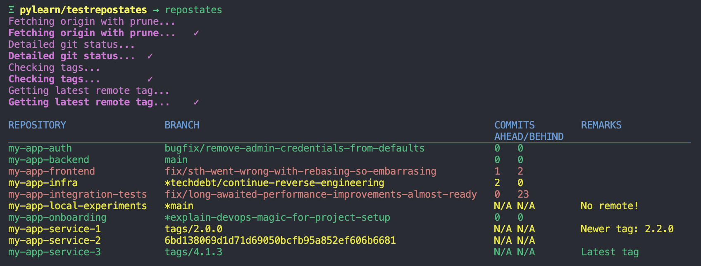
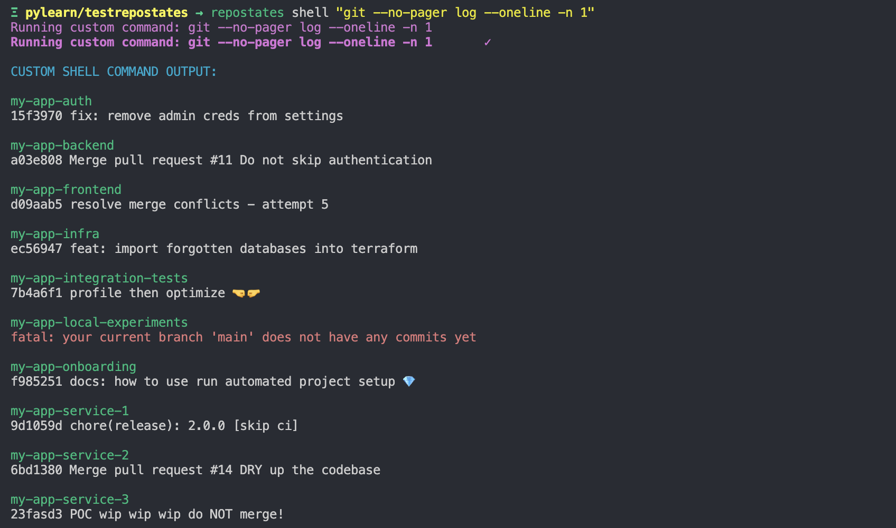
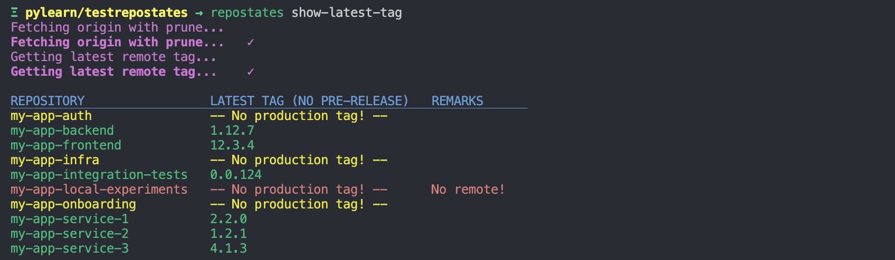
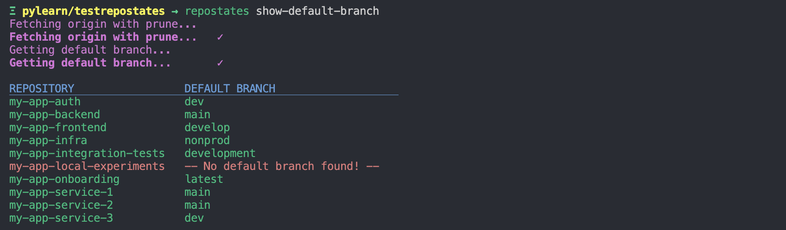
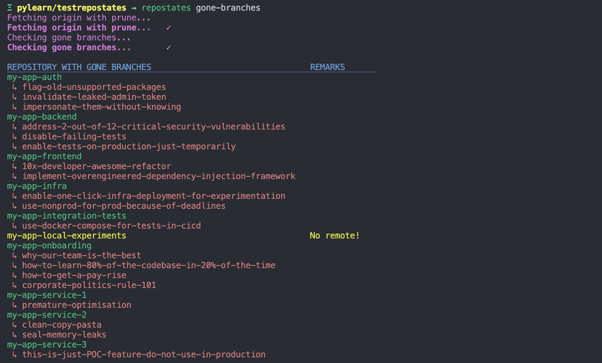
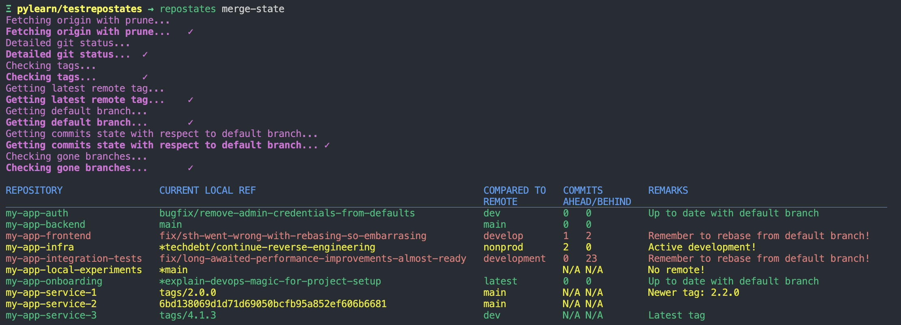

# REPOSTATES

The purpose of the tool is to **manage multiple repositories**, in particular run **the same git or shell command** on a set of repositories in a time efficient, **concurrent way**.

## What it offers?

- meaningful insight into the state of a **set of git repositories**
- **concurrent execution** of commands on multiple repositories
- support for **git commands**
- support for **arbitrary shell commands** and **scripts**
- nice **presentation layer**, especially for `git status`
- a couple of additional commands, like:
  - list latest tags (with checkout)
  - list default branches (with checkout)
  - list already gone branches
  - checkout to default branch
  - checkout to latest tag

## Example

> Disclaimer: Presented example is not a real microservice project. Funny branch names and commit messages were invented just for the sake of repostates demo :)
>
> Side quest: How many examples of bad practices do you notice? :)

### Show status of multiple git repositories (default)



The tool by default *fetches* origin for each repository and then displays the following info:

- current branch, tag or commit
- commits ahead origin
- commits behind origin
- if there are uncommited changes (*)
- if there are more recent tags
- if there is anything to do with each repo (colors)

### Run custom shell command



#### Running more complex commands

```py
# Log latest tag using pipe
repostates shell "sh -c 'git ls-remote --tags --sort=-version:refname | head -n 1 '"
# or use: repostates show-latest-tag ;)

# Checkout to previous branch/tag/commit using shell logical operators (AND, OR)
repostates shell "sh -c 'git switch - || git switch - --detach'"
# or use: repostates shell "git checkout - " ;)
```

### Show latest tags



### Show default branches



### Show already gone branches



### Show merge state

Helpful when touching multiple repositories to deliver a feature - what did I already merge and what is left?



### Checkouts and pull

```py
repostates checkout existing-branch
repostates pull
```

### Special checkouts

These commands run git checkout to the latest tag and to the default project branch respectively (if there are no changes in repos):

```py
repostates checkout-latest-tag
repostates checkout-default-branch
```

## Background story

Basically, when I wanted to run integration tests locally for a project with microservice architecture (with Docker and docker-compose) I always had to check every repository if I am on a correct branch and if this branch is up to date (new commits from other developers). That meant either running the same git commands multiple times from the terminal or clicking through a Git client UI.

This project was created to overcome this inconvenience by automating repetitive actions with a simple command line utility. The tool, when run, presents a short summary in a table format which shows which repositories are up-to-date and which ones have to be updated or investigated more carefully.

Other use cases:

- commiting the same changes, e.g.:
  - updating references to external resources, like CICD pipeline version
  - updating dependencies and packages versions
  - updating project info
- managing git/project configuration and installation
- gathering statistics for multiple repositories

## Getting Started & Installing

The script is created using only inbuild Python3 libraries, so there is no need to use a virtual environment or install anything else then what is already provided with standard Python distribution.

Then, the best option to run the tool is to clone the repository and:

- use the tool directly

    ```sh
    ~/<path-to-repostates>/repostates.py --help
    ```

- or create a suitable alias in `.zshrc` or `.bash_profile`, e.g.:

    ```sh
    alias repostates="python3 /<path-to-repostates>/repostates.py"
    ```

    It is possible to append the new alias to your shell init script by running:

    ```sh
    echo 'alias repostates="python3 /<path-to-repostates>/repostates.py"' >> ~/.zshrc
    ```

    And then run:

    ```sh
    repostates --help
    ```

## Usage

```bash
$ repostates --help

usage: repostates.py [-h] [-d [DIR]] [-r REG] [--verbose] [--no-fetch]
                     {status,pull,show-default-branch,show-latest-tag,checkout,checkout-default,checkout-latest-tag,gone-branches,shell,merge-state} ...

positional arguments:
  {status,pull,show-default-branch,show-latest-tag,checkout,checkout-default,checkout-latest-tag,gone-branches,shell,merge-state}
                        choose a command to run
    status              run git status (default)
    pull                run git pull
    show-default-branch
                        show default branch for repository
    show-latest-tag     show latest production tag for repository (no pre-releases)
    checkout            run git checkout
    checkout-default    checkout to default branch
    checkout-latest-tag
                        checkout to latest tag
    gone-branches       find already gone branches, default action is list
    shell               run arbitrary shell command - enclose in quotes
    merge-state         check if you need to merge/rebase your feature branch with respect to default branch

options:
  -h, --help            show this help message and exit
  -d, --dir [DIR]       directory with your git repositories, defaults to the current directory
  -r, --reg REG         regex for filtering repositories to show
  --verbose, -v         increase verbosity
  --no-fetch, -n        do not fetch before status
```

## Alternatives

- [gita](https://github.com/nosarthur/gita) - support for git (concurrent) and shell commands (sequential), nice presentation layer for git status

- [clustergit](https://github.com/mnagel/clustergit) - support for git and shell commands, concurrent execution, really nice presentation layer

- [mu-repo](https://github.com/fabioz/mu-repo) - supports git and shell commands, concurrent execution, presentation layer could be better

- [gitbatch by isacikgoz](https://github.com/isacikgoz/gitbatch) - support for a couple of git commands, concurrent execution, mind-blowing presentation layer

- [git-repo-updater  - gitup](https://github.com/earwig/git-repo-updater) - support for git and shell commands, nice presentation layer for default command, serial execution

- [git-plus](https://github.com/tkrajina/git-plus) - only git commands are supported, serial execution, some nice git commands for single repos are provided

- [gitas](https://github.com/lukasz-lobocki/gitas) - nice presentation layer for status, support for git and shell commands (presentation layer could be better here), unclear if concurrency is used

- [git for-each-repo](https://manpages.ubuntu.com/manpages/jammy/en/man1/git-for-each-repo.1.html) - support for git commands, need to be configured

- [git-bulk](https://github.com/tj/git-extras/blob/main/Commands.md#git-bulk) as part of [git-extras](https://github.com/tj/git-extras) - support for git commands, serial execution

- [gitbatch by lewisliu725](https://github.com/lewisliu725/gitbatch) - simple shell script for running the same git command in multiple repositories, only git commands supported, serial execution

- Bash one-liners and functions

  ```bash
  find . -type d -depth 1 -print -exec git -C {} status \;

  find . -type d -depth 1 -print -exec bash -c "git -C {} status; echo;" \;

  find . -type d -depth 1 -print -exec bash -c "(git -C {} status && echo)" ";"

  find . -type d -depth 1 -print -exec git --git-dir={}/.git --work-tree=$PWD/{} status \;

  find . -maxdepth 2 -type d -name .git -print | xargs  -P8 -I{} git -C {}/../ status

  for i in */.git; do ( echo $i; cd $i/..; git status; echo; ); done

  for repo in *; do pushd $repo &> /dev/null; echo "Current repo: $repo"; popd &> /dev/null; done

  ls | xargs -P10 -I{} git -C {} pull
  ```

  ```sh
  gitez() {
      if [ $# -lt 1 ]
      then
        echo "$0: error: missing arguments"
        echo "usage: $0 <command> <args...>"
        exit 1
      fi

      for folder in `find . -maxdepth 1 ! -path . -type d`
      do
        if [ -d "$folder"/.git ];
        then
          pushd . > /dev/null
          cd "$folder"
          echo '\033[1;32m'
          echo `pwd`
          echo '\033[0m'
          "$@"
          popd > /dev/null
        fi
      done
  }
  ```

Tools that offer interacting with GitLab or GitHub, e.g.: running the same script against set of repositories, commiting changes, creating Merge/Pull Requests and checking their status:

- [multi-gitter](https://github.com/lindell/multi-gitter)
- [git-xargs](https://github.com/gruntwork-io/git-xargs)

Other:

- [multi-git](https://github.com/the-gigi/multi-git)
- [gitman](https://github.com/fabiospampinato/gitman)
- [myrepos](https://github.com/RichiH/myrepos)
- [git-status-all](https://github.com/reednj/git-status-all)
- [git-repo (from Gerrit)](https://github.com/GerritCodeReview/git-repo) - not inituitive installation

## License

MIT License

## Contributing

Please, create pull requests in order to contribute.

### Taskfile

List possible linting commands with Taskfile:

```sh
task
```

Link: https://taskfile.dev/#/

## Authors

* [harper25](https://github.com/harper25)
